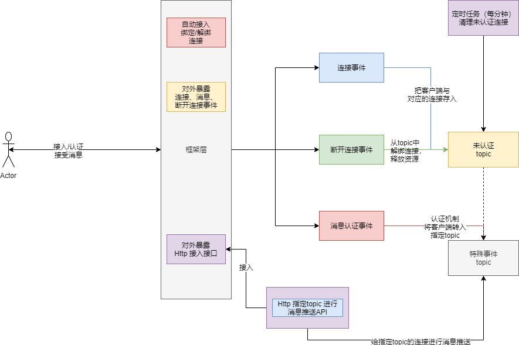

# `gws` 为一个基于事件与切面编程思想所实现的一个基础框架

- 项目灵感来源 `swoole`  
- 感谢 `github.com/gorilla/websocket` 为本项目提供 `webSocket` 服务 所需的基础

## `v0.0.1` 版本的目标

- ~~能接受单个连接的消息与给单个连接发送消息~~
- ~~能感知当前连接的总数量~~
- ~~连接成员间能相互传递消息~~
- ~~能通过 `http` 请求给对应连接的成员发送消息~~

## 怎么使用？

- 我使用 `go mod` 作为包管理工具
- 在 `go.mod` 中 加入 `github.com/whyiyhw/gws` 或者 `go get github.com/whyiyhw/gws`

```go
    // default 127.0.0.1:9501/ws
	s := new(gws.Server)

    // 接收消息事件
	s.OnMessage = func(c *gws.Conn, fd int, msg string, err error) {
		fmt.Printf("client %d said %s \n", fd, message)
	}

    // 连接成功事件
	s.OnOpen = func(c *gws.Conn, fd int) {
		fmt.Printf("client %d online \n", fd)
	}

    // 连接关闭事件
	s.OnClose = func(c *gws.Conn, fd int) {
		fmt.Printf("client %d had offline \n", fd)
	}

    // 启动服务
	if err := s.ListenAndServe(); err != nil {
		panic(err)
	}

```

- 再使用 浏览器工具栏 连接 `ws://127.0.0.1:9501/ws` 就可以愉快的玩耍了~

## 其它 特性请查看 examples 自行测试~

`v0.0.2` 版本

- 修复主动关闭时未触发关闭事件的 Bug
- 增加通用的消息推送架构设计图
- 

都看到这里了 给个 💖 吧

